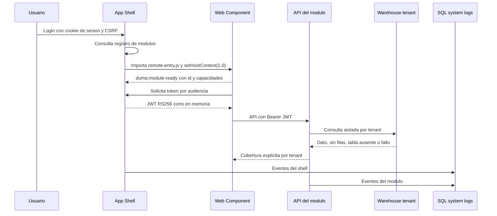

# Operacion, arranque y configuracion

## 1. Alcance

Este runbook cubre el arranque independiente de cada aplicacion y el arranque integrado mediante `app-shell`. No contiene valores reales de secretos. Los nombres exhaustivos de variables se mantienen junto a cada backend en `application.example.yml`.

## 2. Componentes y puertos

| Aplicacion | Backend | Frontend de desarrollo | Responsabilidad |
|---|---:|---:|---|
| `app-shell` | 8080 | 5173 | Autenticacion, resumen ICOS, registro y tokens por modulo |
| `experiencia-digital` | 8081 | 5174 | Experiencia de usuario y disponibilidad |
| `lecturas` | 8082 | 5175 | Continuidad y excepciones de lecturas |
| `dispositivos` | 8083 | 5176 | Salud, riesgo y evidencia por tipo de equipo |
| `smartaudits` | 8084 | 5177 | Analitica SmartAudits y revision humana Carls Jr |

Cada frontend se compila dentro de `backend/src/main/resources/static`; esa salida es generada y no se versiona. El JAR Spring Boot resultante sirve la aplicacion standalone y, en los cuatro modulos, `remote-entry.js`.

### 2.1 Puertos deterministas

Los diez puertos se definen desde variables canonicas:

| Proceso | Variable |
|---|---|
| Shell backend | `DUMA_SHELL_BACKEND_PORT` |
| Experiencia backend | `DUMA_EXPERIENCE_BACKEND_PORT` |
| Lecturas backend | `DUMA_READINGS_BACKEND_PORT` |
| Dispositivos backend | `DUMA_DEVICES_BACKEND_PORT` |
| SmartAudits backend | `DUMA_SMARTAUDITS_BACKEND_PORT` |
| Shell frontend | `DUMA_SHELL_FRONTEND_PORT` |
| Experiencia frontend | `DUMA_EXPERIENCE_FRONTEND_PORT` |
| Lecturas frontend | `DUMA_READINGS_FRONTEND_PORT` |
| Dispositivos frontend | `DUMA_DEVICES_FRONTEND_PORT` |
| SmartAudits frontend | `DUMA_SMARTAUDITS_FRONTEND_PORT` |

Crear una configuracion local a partir de la plantilla y cargarla en la terminal que arrancara los procesos:

```powershell
Copy-Item .\config\ports.example.ps1 .\config\ports.local.ps1
. .\config\ports.local.ps1
```

`ports.local.ps1` esta ignorado por Git y debe contener solamente puertos. Vite, sus proxies, Playwright, Spring Boot, el issuer local, JWKS, CORS y las URLs remotas derivan de estas variables. Todos los servidores Vite usan `strictPort`; un conflicto detiene el arranque con un error y nunca selecciona un puerto desconocido.

Los nombres anteriores `APP_SHELL_PORT`, `EXPERIENCE_PORT`, `READINGS_PORT`, `DEVICES_PORT` y `SMARTAUDITS_PORT` siguen aceptados como fallback para no romper ejecuciones existentes. Las variables canonicas tienen precedencia.

## 3. Prerrequisitos

- Java 17 y Maven 3.9, o Docker Desktop para usar la imagen Maven documentada.
- Node.js 24 y npm 11 compatibles con los `package-lock.json` actuales.
- Chromium de Playwright para E2E.
- Acceso de red desde cada backend al SQL Server de auditoria.
- Acceso de red desde cada modulo a los warehouses SQL Server configurados.
- Esquemas de base de datos inicializados con los scripts `db/init` de cada aplicacion.

No se requiere ni se permite versionar un archivo `.env`. La configuracion se inyecta como variables del proceso desde el sistema operativo, el orquestador o el gestor de secretos autorizado.

## 4. Preparacion de bases

### 4.1 System logs

Cada aplicacion incluye scripts idempotentes en su directorio `db/init`:

1. Ejecutar `01-schema.sql` o `01-system-log.sql` en la base indicada por `DUMA_SYSTEMLOG_MSSQL_DATABASE`.
2. Ejecutar `02-procedures.sql` o `02-system-log-procedure.sql` en la misma base.

Las aplicaciones pueden compartir la base fisica de auditoria, pero cada evento conserva su `application_id`. Los backends no almacenan tokens, contrasenas, comentarios SmartAudits, filas de negocio ni payloads de sensores en `audit.system_event`.

### 4.2 Autenticacion del shell

Ejecutar primero los dos scripts de `app-shell/db/init`. El alta de usuarios se realiza mediante `security.usp_UpsertAppUser` y recibe un hash BCrypt, nunca una contrasena en texto plano. Los campos `roles_csv`, `permissions_csv` y `tenant_scope_csv` quedan preparados para una revision futura; en este corte viajan en la sesion y el JWT, pero no aplican reglas de autorizacion.

### 4.3 Warehouses

Cada modulo abre un pool independiente por tenant. Un nombre de base vacio produce `UNAVAILABLE` solamente para ese tenant. Una tabla ausente produce `NOT_SUPPORTED` y una tabla presente sin filas produce `NO_DATA`; ninguno de estos estados se convierte en cero operativo.

## 5. Variables y secretos

### 5.1 Variables compartidas por backend

| Variable | Secreta | Uso |
|---|---|---|
| `DUMA_SYSTEMLOG_MSSQL_HOST` | No | Host o IP del SQL Server de auditoria accesible desde este equipo |
| `DUMA_SYSTEMLOG_MSSQL_PORT` | No | Puerto SQL Server |
| `DUMA_SYSTEMLOG_MSSQL_DATABASE` | No | Base de system logs |
| `DUMA_SYSTEMLOG_MSSQL_USERNAME` | Si | Identidad de escritura de auditoria |
| `DUMA_SYSTEMLOG_MSSQL_PASSWORD` | Si | Credencial de auditoria |
| `DUMA_SYSTEMLOG_MSSQL_ENCRYPT` | No | Cifrado JDBC |
| `DUMA_SYSTEMLOG_MSSQL_TRUST_SERVER_CERTIFICATE` | No | Confianza explicita del certificado; debe permanecer `false` fuera de entornos controlados |

### 5.2 Variables compartidas por microfrontend

| Variable | Secreta | Uso |
|---|---|---|
| `DUMA_WAREHOUSE_MSSQL_HOST` | No | Host o IP de warehouses |
| `DUMA_WAREHOUSE_MSSQL_PORT` | No | Puerto de warehouses |
| `DUMA_WAREHOUSE_MSSQL_USERNAME` | Si | Identidad de solo lectura; SmartAudits requiere ademas las escrituras acotadas de la cola |
| `DUMA_WAREHOUSE_MSSQL_PASSWORD` | Si | Credencial del warehouse |
| `DUMA_WAREHOUSE_MSSQL_ENCRYPT` | No | Cifrado JDBC |
| `DUMA_WAREHOUSE_MSSQL_TRUST_SERVER_CERTIFICATE` | No | Politica de certificado JDBC |
| `DUMA_WAREHOUSE_POOL_SIZE_PER_TENANT` | No | Limite de conexiones por tenant |
| `DUMA_AUTH_ISSUER` | No | Emisor esperado del shell |
| `DUMA_AUTH_JWKS_URI` | No | JWKS publico del shell |
| `DUMA_<MODULO>_ALLOWED_ORIGINS` | No | Allowlist CORS exacta |
| `DUMA_<MODULO>_STANDALONE_MODE` | No | Permite lectura local sin login; nunca habilita la mutacion SmartAudits |

`<MODULO>` corresponde a `EXPERIENCE`, `READINGS`, `DEVICES` o `SMARTAUDITS`.

### 5.3 Bases por tenant

Los siete nombres se configuran de forma independiente:

- `DUMA_TENANT_CARLSJR_DATABASE`
- `DUMA_TENANT_EMERSON_DATABASE`
- `DUMA_TENANT_VALLEDELENCINO_DATABASE`
- `DUMA_TENANT_MCDONALDS_DATABASE`
- `DUMA_TENANT_MCDONALDS_CDP_DATABASE`
- `DUMA_TENANT_SMARTFIT_DATABASE`
- `DUMA_TENANT_BAFAR_POC_GABINETE_DATABASE`

No se deben inventar nombres. Si una base no esta liberada, la variable queda vacia y el contrato devuelve `UNAVAILABLE` para ese tenant.

### 5.4 Estado visible por modulo

Cada prefijo de modulo define:

| Sufijo | Valores permitidos | Significado |
|---|---|---|
| `RELEASE_STAGE` | `DEVELOPMENT`, `TESTING`, `STAGING`, `PRODUCTION` | Madurez del software |
| `DATA_ENVIRONMENT` | `DEVELOPMENT`, `TEST`, `STAGE`, `PRODUCTION` | Procedencia del dato |
| `FRESHNESS_MODE` | `LIVE`, `SNAPSHOT`, `MOCK` | Frescura declarada |
| `TENANT_SCOPE` | `ALL_TENANTS`, `SELECTED_TENANTS`, `CARLSJR_ONLY` | Alcance declarado |
| `CLEARANCE` | `ACADEMIC_PRIVATE`, `INTERNAL`, `RESTRICTED` | Clasificacion |
| `REMOTE_ENTRY_URL` | URL absoluta | ESM que registra el Custom Element |
| `API_BASE_URL` | URL absoluta | API del modulo |

El badge informa estas dimensiones por separado. No constituye por si mismo una frontera de seguridad.

### 5.5 Variables exclusivas del shell

| Variable | Secreta | Uso |
|---|---|---|
| `APP_SHELL_PORT` | No | Puerto del shell |
| `DUMA_SESSION_TIMEOUT` | No | Duracion de sesion |
| `DUMA_SESSION_SECURE_COOKIE` | No | Exige cookie de sesion sobre HTTPS |
| `DUMA_MODULE_TOKEN_TTL` | No | Vida de cada JWT de modulo |
| `DUMA_JWT_PRIVATE_KEY_BASE64` | Si | Llave RSA privada PKCS#8 codificada en Base64 |
| `DUMA_JWT_PUBLIC_KEY_BASE64` | No | Llave RSA publica X.509 codificada en Base64 |
| `DUMA_ALLOW_EPHEMERAL_KEYS` | No | Solo desarrollo; debe ser `false` en un despliegue persistente |

La llave privada y las contrasenas se inyectan desde un gestor autorizado. No deben aparecer en argumentos de linea de comandos, logs, documentos, historiales, archivos del repo ni capturas.

## 6. Arranque standalone

Desde la raiz del repo, repetir para el modulo deseado:

```powershell
. .\config\ports.local.ps1
Set-Location .\experiencia-digital\frontend
npm.cmd ci
npm.cmd run build
Set-Location ..\backend
mvn spring-boot:run -Dspring-boot.run.profiles=dev
```

Sustituir el directorio por `lecturas`, `dispositivos` o `smartaudits`. Antes de iniciar, inyectar en el proceso las variables declaradas en `backend/application.example.yml`.

El perfil `dev` habilita lectura standalone. SmartAudits mantiene bloqueada la cola humana porque aprobar/promover requiere un JWT emitido por el shell. La UI lo comunica como estado protegido, no como error de datos.

## 7. Arranque integrado

1. Inicializar las tablas/procedimientos de auditoria y la autenticacion del shell.
2. Cargar `config/ports.local.ps1` en cada terminal u orquestador.
3. Inyectar variables y secretos de los cuatro modulos.
4. Compilar cada frontend con `npm.cmd ci` y `npm.cmd run build`.
5. Iniciar los cuatro backends sin el perfil `dev`.
6. Inyectar variables y secretos del shell. Si no se definen URLs remotas explicitas, el shell las deriva de los puertos backend canonicos.
7. Compilar `app-shell/frontend`.
8. Iniciar `app-shell/backend`.
9. Acceder unicamente por la URL del shell y autenticar una identidad creada en `security.app_user`.

Comando de backend en cada directorio:

```powershell
mvn spring-boot:run
```

El shell puede iniciar antes que un modulo, pero ese modulo mostrara un fallo de integracion aislado hasta que su `remote-entry.js` este disponible.

## 8. Orquestacion y comunicacion



El contexto host contiene locale, zona horaria, periodo, tenants, identidad y callbacks. Los modulos no comparten React, CSS, cookies ni almacenamiento. Cada API valida `iss`, firma, expiracion y `aud`; un token de un modulo no es aceptado por otro.

## 9. SmartAudits

La analitica consulta los siete tenants con el mismo aislamiento de cobertura. La cola humana usa exclusivamente la base `carlsjr`, acepta solo `AiResult = 0`, cinco categorias permitidas y una llave compuesta de hash mas resultado. La promocion ocurre en una transaccion directa y finaliza en `PROMOTED`; no invoca el job automatico.

## 10. Validacion reproducible

La raiz contiene `scripts/validate.ps1`:

```powershell
powershell.exe -NoProfile -ExecutionPolicy Bypass -File .\scripts\validate.ps1 -Install
```

El comando ejecuta instalación limpia opcional, lint, unitarias, build y E2E de los cinco frontends; despues ejecuta `mvn verify` con Java 17 y Testcontainers SQL Server. Cada corrida crea evidencia local en `docs/auditoria-temporal/runs` sin leer `.env` ni imprimir secretos.

Opciones:

- Omitir reinstalacion: ejecutar sin `-Install`.
- Omitir temporalmente E2E: `-SkipE2E`; no usar esta opcion como evidencia de liberacion.
- Cargar otro archivo de puertos: `-PortsFile C:\ruta\ports.local.ps1`.

`ExecutionPolicy Bypass` aplica solo a ese proceso y no modifica la politica del equipo.
